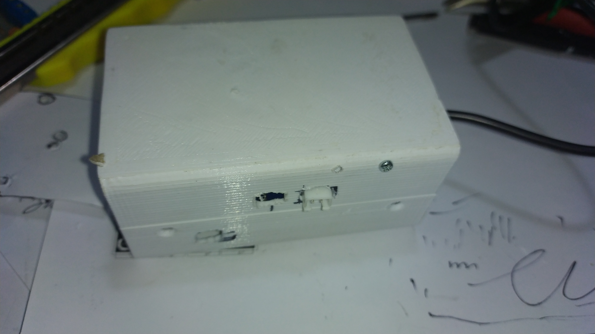

# homeassistant
Various files for home assistant and esp home 

1) Oil Tank ultrasonic sensor (using ESP32 as controller)
   i use this for the JSN-SR04T sensor https://www.thingiverse.com/thing:5404031
   
   
   
   
   
   
2) NTC Thermistor Sensor
   Device for up to 4 thermistors NTC can be tracked.
   You must have a 10K resistor between the ESP32 pin and the ground for each thermistor.
   These Thermistors can be found here https://www.aliexpress.com/item/1005005988152345.html

3) Oil Tank ultrasonic sensor and 5 NTC Thermistors Sensor (using ESP32 as controller)
   
   
   
   
   
   
   
   
   
